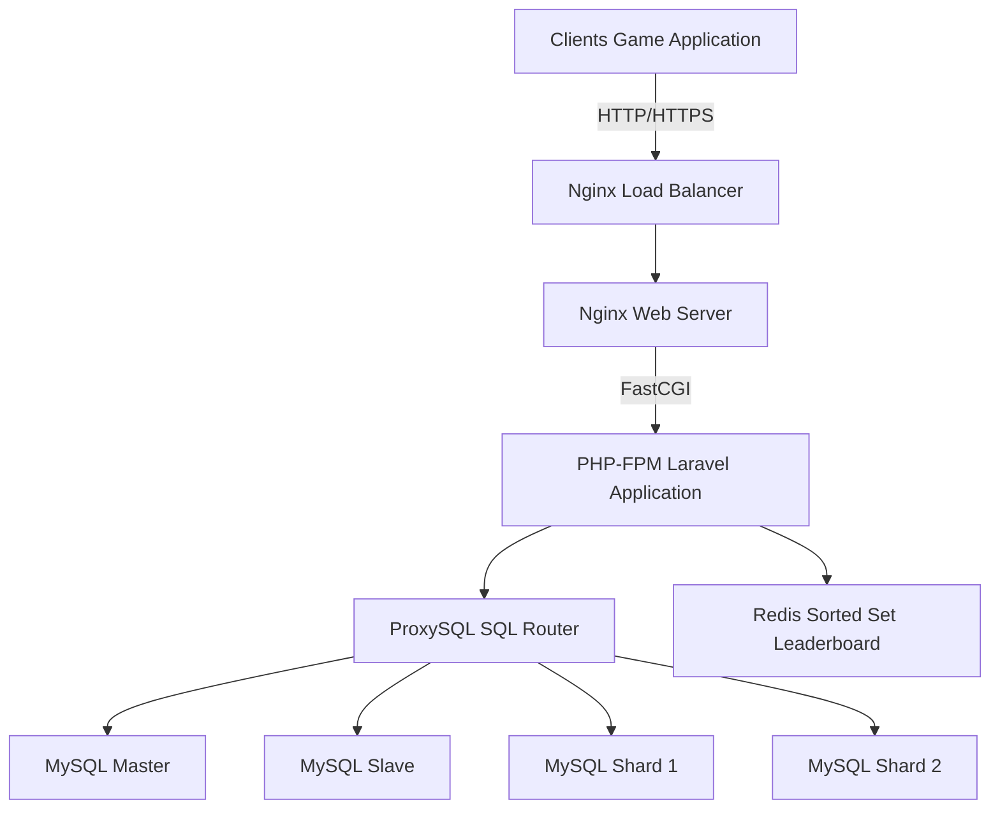

# 高併發遊戲排行榜系統 — High-Concurrency Game Leaderboard System

一個以 **Laravel 11 + PHP 8.x Attributes + Redis Sorted Set + ProxySQL + MySQL 分片** 為核心技術棧的排行榜系統原型，設計目標是能在極高併發下提供毫秒級排行榜查詢與穩定的分數寫入能力。此專案同時示範分層設計、讀寫分離、資料分片、快取持久化與可觀測性等工程實務，並以 Docker 容器化確保開發與部署環境一致性。

---

## Project Overview

**目標**：建立一個可擴展、高可用且高效能的遊戲排行榜系統原型，能處理大量玩家分數寫入與排行榜查詢。  
**核心理念**：  
- **Redis 作為即時排行榜主資料層**，使用 Sorted Set 實現快速排序與查詢。  
- **MySQL 分片與主從複製** 解決資料寫入與查詢瓶頸。  
- **ProxySQL 作為資料庫中間件**，實現應用端無感知的讀寫分離與分片路由。  
- **Laravel 應用層** 採用 Repository 與 Service 分層、PHP Attributes 宣告分片需求、Artisan 命令支援離線重建與維運。

**主要功能亮點**：  
- 毫秒級排行榜查詢（Redis Sorted Set）  
- 支援高併發分數上傳（ProxySQL + MySQL Shards）  
- 可從 MySQL 重建 Redis 排行榜（Artisan 命令）  
- 容器化部署與壓力測試腳本支援

---

## Architecture Overview

系統採分層設計，主要組件包含：客戶端、Nginx、PHP-FPM（Laravel）、ProxySQL、MySQL Master/Slave/Shards、Redis、監控與維運工具。下圖為簡化架構示意：



#### Components

- **Nginx Load Balancer**  
  負責 SSL 終止、反向代理與流量分發，建議放置健康檢查與基本限流策略。

- **Nginx Web Server**  
  處理靜態資源、緩存與反向代理至 PHP-FPM，減少後端負載。

- **PHP-FPM Laravel Application**  
  - **控制器**：`ScoreController` 與 `LeaderboardController` 處理 API。  
  - **服務層**：`ScoreService` 與 `LeaderboardService` 封裝業務邏輯。  
  - **儲存庫層**：`PlayerScoreRepository` 負責分片路由與 DB 存取。  
  - **Attributes**：用於標記需要分片或特殊連線的 Model。  
  - **Artisan 命令**：`RebuildLeaderboards` 用於從 MySQL 重建 Redis。

- **ProxySQL**  
  作為統一的 MySQL 入口，實作讀寫分離、查詢路由與 hostgroup 管理，對應分片表可透過查詢規則或註釋路由到正確 Shard。

- **MySQL Master / Slave / Shards**  
  - **Master**：處理寫入並產生 binlog。  
  - **Slave**：承擔讀取負載。  
  - **Shards**：依 `player_id` hash 分散 `player_scores`，每個 shard 可再做主從以提升可用性。

- **Redis Sorted Set**  
  以 `game_id` 為 Key，`score` 為 score，`player_id` 為 member。使用 `ZADD`、`ZREVRANGE`、`ZREVRANK`，並可用 Lua 腳本實現原子化邏輯。啟用 AOF 或 RDB 以降低資料遺失風險。

- **Observability**  
  集中化日誌、Prometheus/Grafana 監控、壓力測試腳本與告警機制，監控項目包含 API 延遲、P95/P99、DB replication lag、Redis 命中率等。

---

## Getting Started

以下為在本地使用 Docker 啟動專案的快速上手步驟。

**先決條件**  
- **Docker Desktop**（含 Docker Engine 與 Docker Compose）  
- **Git**

**快速啟動**

```bash
git clone https://github.com/your-username/leaderboard-system.git
cd leaderboard-system

cp .env.example .env
cp src/.env.example src/.env
# 編輯 .env 與 src/.env，設定 MySQL/Redis/ProxySQL 等參數

docker-compose build --no-cache
docker-compose up -d

# 初始化資料庫與 ProxySQL
./scripts/init_all_dbs.sh

# 若 src/.env 的 APP_KEY 為空，生成 Laravel key
docker-compose exec php-fpm php artisan key:generate
```

**測試 API 範例**

上傳分數：

```bash
curl -X POST -H "Content-Type: application/json" \
  -d '{"player_id":1,"game_id":1,"score":100}' \
  http://localhost/api/v1/scores
```

查詢排行榜：

```bash
curl "http://localhost/api/v1/leaderboards?game_id=1&offset=0&limit=50"
```

查詢玩家排名：

```bash
curl "http://localhost/api/v1/leaderboards/1/player/1"
```

**停止與清理**

```bash
docker-compose down
# 若要移除資料卷（會刪除所有資料），請小心使用：
docker-compose down -v
```

---

## API Reference

**Base URL**  
`http://localhost/api/v1`

### POST /scores
上傳或更新玩家分數。

**Request Body**

| name | type | description |
| --- | --- | --- |
| player_id | integer | 玩家唯一 ID |
| game_id | integer | 遊戲唯一 ID |
| score | integer | 玩家分數 |

**成功回應 201**

```json
{
  "message": "Score updated successfully",
  "player_score": {
    "player_id": 12345,
    "game_id": 1,
    "score": 1500,
    "updated_at": "2023-10-27T10:00:00.000000Z",
    "created_at": "2023-10-27T10:00:00.000000Z"
  }
}
```

### GET /leaderboards
取得指定遊戲排行榜。

**Query Parameters**

| name | type | description |
| --- | --- | --- |
| game_id | integer | 遊戲唯一 ID |
| offset | integer | 起始位置，預設 0 |
| limit | integer | 返回數量，預設 100，最大 1000 |

**成功回應 200**

```json
{
  "game_id": 1,
  "leaderboard": [
    { "player_id": 98765, "score": 2500, "rank": 1 },
    { "player_id": 12345, "score": 1500, "rank": 2 }
  ],
  "offset": 0,
  "limit": 50
}
```

### GET /leaderboards/{gameId}/player/{playerId}
取得單一玩家在指定遊戲的排名與分數。

**成功回應 200**

```json
{
  "game_id": 1,
  "player_id": 12345,
  "rank": 2,
  "score": 1500
}
```

---

## Deployment and Operations

**容器化與部署**  
- 使用 `docker-compose` 在開發與測試環境快速啟動。  
- 生產環境建議使用 Kubernetes 或雲端容器服務，並將 Nginx、PHP-FPM、ProxySQL、Redis 與 MySQL 分別做水平擴展。

**擴展策略**  
- **讀取擴展**：增加 Redis 與 MySQL 的讀取節點，ProxySQL 負責路由。  
- **寫入擴展**：新增 MySQL Shard，並在 `ShardResolver` 中更新路由邏輯。  
- **Redis 高可用**：採 Redis Cluster 或 Sentinel 架構以提升可用性。

**備份與恢復**  
- 定期備份 MySQL 與 Redis（AOF 與 RDB）。  
- 提供 `RebuildLeaderboards` Artisan 命令從 MySQL 聚合資料重建 Redis。

**監控與告警**  
- 建議使用 Prometheus + Grafana 監控 API 延遲、P95/P99、DB replication lag、Redis 命中率與 ProxySQL 連線數。  
- 設定告警以監控異常流量、錯誤率與資源飽和。

**壓力測試**  
- 提供 `scripts/load_test.sh`，可搭配 `k6` 或 `ab` 模擬高併發讀寫混合場景，驗證系統瓶頸與自動擴展行為。

---

## Development and Contributing

**主要目錄結構**

```text
leaderboard-system/
├── docker-compose.yml
├── src/                      # Laravel 應用程式
│   ├── app/
│   │   ├── Attributes/
│   │   ├── Console/Commands/
│   │   ├── Http/Controllers/
│   │   ├── Repositories/
│   │   └── Services/
│   ├── config/
│   └── database/
├── mysql-master/
├── mysql-shard-1/
├── proxysql/
├── redis/
├── scripts/
└── docs/
```

**測試**  
- 使用 PHPUnit 撰寫單元測試與功能測試。  
- 建議在 CI 中加入測試、靜態分析（PHPStan 或 Psalm）與 lint 檢查。

**貢獻指南**  
- Fork 本專案並建立 feature branch。  
- 提交 PR 前請確保測試通過並補上必要的文件。  
- 在 PR 描述中說明變更目的與測試方式。

**授權**  
- 請在專案根目錄加入合適的 License（例如 MIT）。
