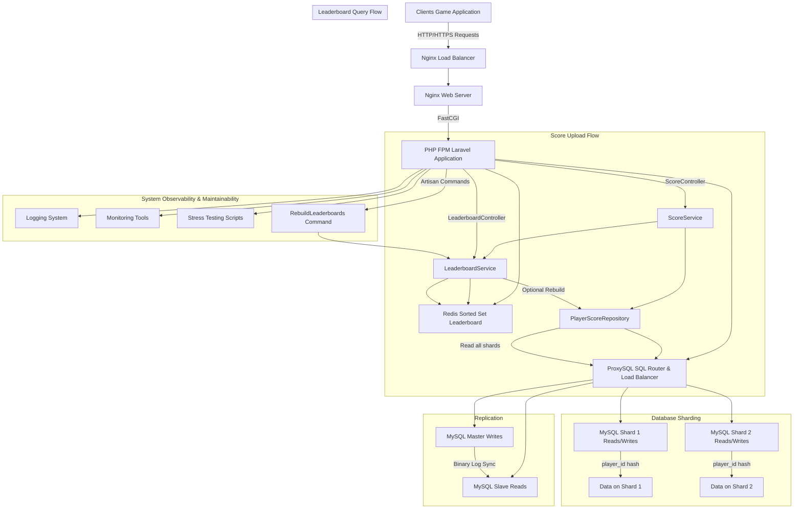

## 高併發遊戲排行榜系統 - 架構說明

### 專案目標與藍圖
[在此處複製您最初提供的專案目標藍圖內容。若需要，我可以幫您把藍圖內容補齊並轉為可發佈的專案簡介。]

### 整體架構圖
下面為系統視覺化架構圖，展示主要組件與互動流程：

### 各組件詳述

#### 客戶端
**角色與責任**：遊戲客戶端或第三方服務負責上傳玩家分數與查詢排行榜。
**注意事項**：採用短連線、重試與退避策略以應對網路波動；對高併發場景建議在客戶端做簡單的節流與批次上傳。

#### Nginx 負載均衡器
**角色與責任**：接收外部流量，做 SSL 終止、反向代理與健康檢查，將請求分發到多個 Web Server 實例。
**可擴展性**：可水平擴展多個 Nginx 節點並放在前端負載均衡器或雲端 LB 之後。

#### Nginx Web Server
**角色與責任**：靜態資源處理、反向代理至 PHP-FPM，處理基本緩存與 gzip。
**最佳實務**：設定合理的 keepalive、緩存與限流，避免單一節點成為瓶頸。

#### PHP FPM Laravel 應用程式
**角色與責任**：處理 API 請求，包含控制器、服務層、儲存庫層與 Artisan 命令。
**架構要點**：
- **控制器**：負責驗證請求、回傳標準化 API 回應與錯誤處理。
- **服務層**：封裝業務邏輯（例如 ScoreService、LeaderboardService），便於測試與重用。
- **儲存庫層**：負責與資料庫交互，處理分片路由與讀寫分離邏輯。
- **Attribute 與服務提供者**：用於注入共用行為、事件監聽與綁定介面實作。
- **Artisan 命令**：例如重建排行榜的命令，用於離線重建或維運作業。

#### Redis Sorted Set Leaderboard
**角色與責任**：作為排行榜的即時資料存儲，使用 Sorted Set（ZSET）以 score 為排序鍵。
**實作細節**：
- **寫入**：使用 `ZADD` 更新玩家分數，搭配 Lua 腳本可實現原子化檢查與更新邏輯。
- **查詢**：使用 `ZREVRANGE` 或 `ZREVRANK` 取得排名與分數。
- **持久化**：啟用 RDB 或 AOF 以降低資料遺失風險；在極端情況下可從 MySQL 重建。
- **重建機制**：提供離線重建流程（從分片 DB 聚合資料並批次寫入 Redis），並在必要時觸發增量同步。

#### ProxySQL SQL Router 與負載均衡
**角色與責任**：在應用與 MySQL 之間做 SQL 路由、讀寫分離與分片透明化。
**功能重點**：
- **讀寫分離**：將寫入導向 Master，讀取導向 Slave 或 Shard 的讀取節點。
- **查詢規則**：透過正則或規則集將特定查詢導向不同 hostgroup。
- **高可用性**：支援動態變更後端節點與健康檢查，減少應用端複雜度。

#### MySQL Master 寫入節點
**角色與責任**：處理所有寫入操作與 binlog，作為資料一致性的來源。
**備註**：Master 應配置適當的資源與監控，並定期備份。

#### MySQL Slave 讀取節點
**角色與責任**：從 Master 同步 binlog，提供讀取負載分擔。
**注意事項**：讀延遲可能導致短暫的不一致，應在應用層考慮讀寫一致性策略。

#### MySQL Shard 1 與 Shard 2
**角色與責任**：依照 `player_id` 的 hash 或 modulo 將資料分散到不同 Shard，以提升寫入與查詢吞吐量。
**分片邏輯**：通常採用固定 hash 函數或一致性哈希，並在儲存庫層封裝分片路由。
**維運**：支援水平擴展、資料遷移與重新分片策略。

#### 管理與監控
**組件**：日誌系統、監控工具（例如 Prometheus/Grafana）、壓力測試腳本與 Artisan 命令。
**職責**：
- **日誌**：集中化日誌以便追蹤錯誤與分析流量模式。
- **監控**：監控延遲、錯誤率、Redis 命中率與 DB 同步延遲。
- **壓力測試**：定期執行壓力測試以驗證系統在高併發下的行為。
- **維運命令**：提供重建排行榜、資料修補與批次處理的 Artisan 指令。

---

